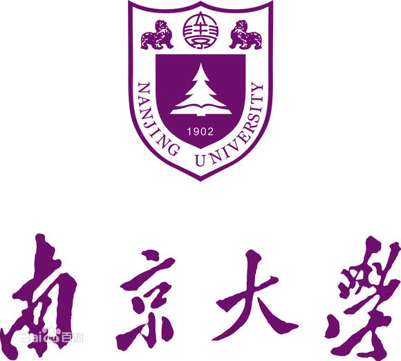
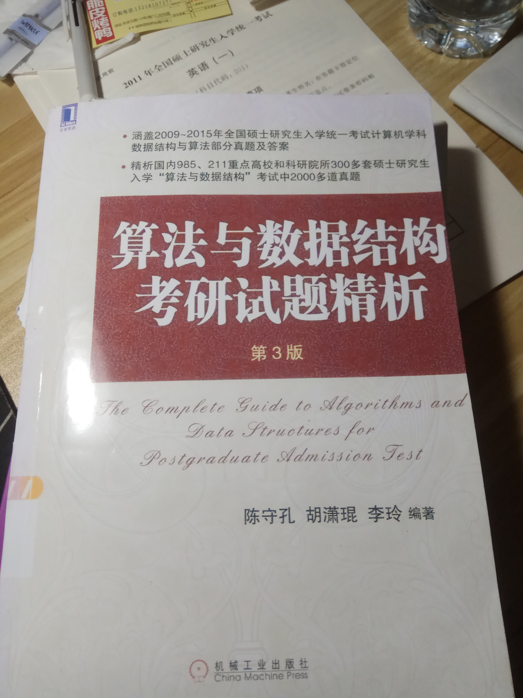
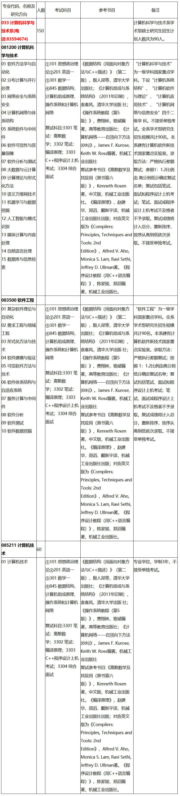
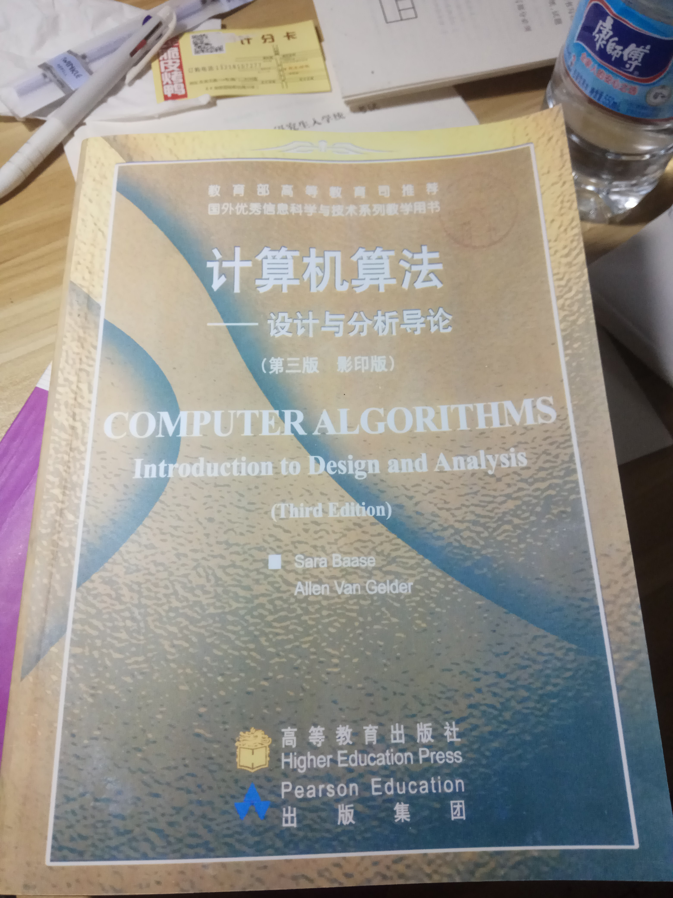
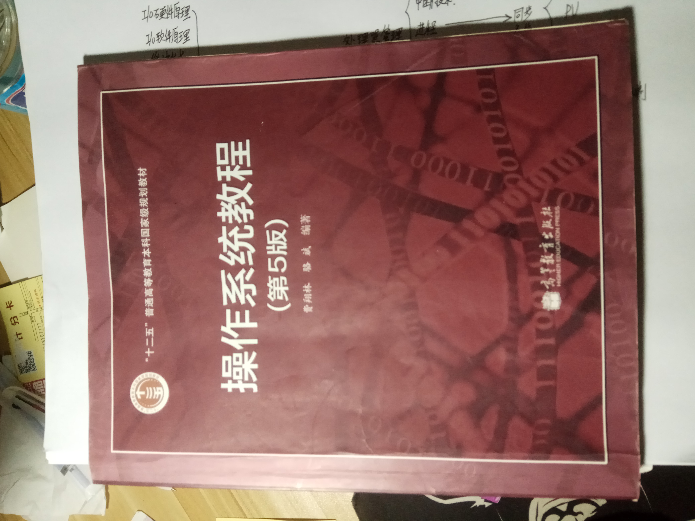
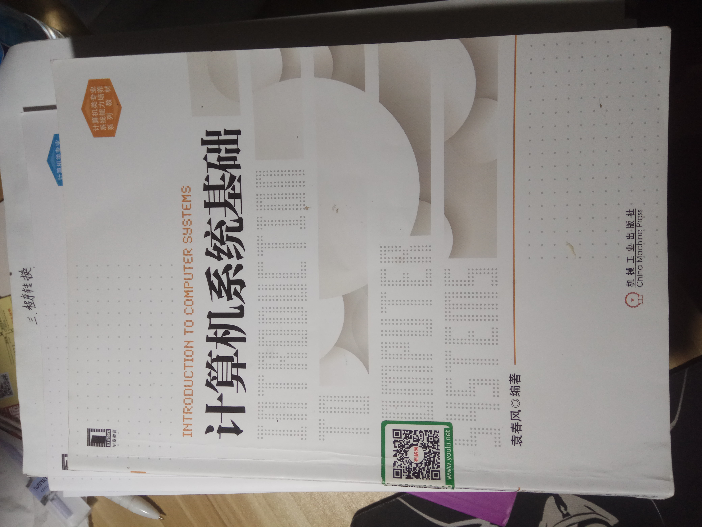
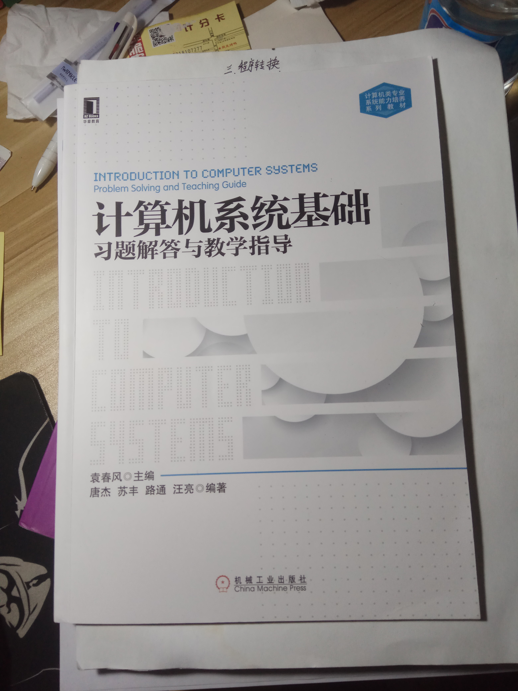
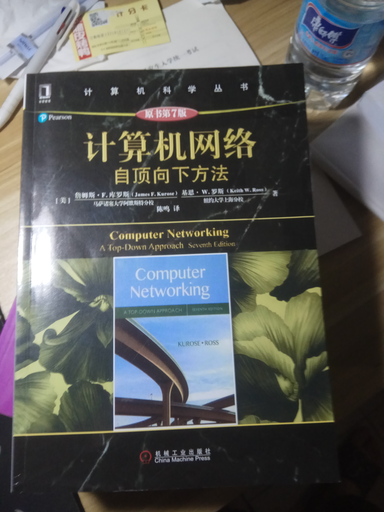
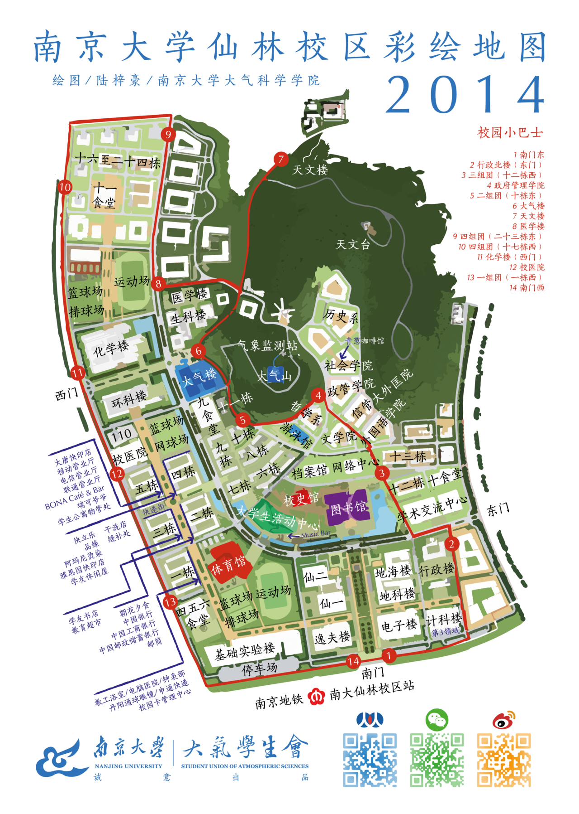

# NJUCS

# 南京大学计算机考研资料合集

## 包括报录比、真题、模拟题、PPT、期末考试等等

***PS:只是整合，所以有的资料上面会有其他机构、论坛、公众号的广告。***

这是本仓库最新的时间内所有文件的大小

使用GitHub Desktop 上传到GitHub中，速度平均为3M/s，如果国内GitHub下载不快，可以考虑fork到自己账号下导入码云下载，可以达到2M/s。

你至少要有office软件、PDF软件、图片查看器

考虑到兼容性问题，推荐使用Microsoft office 2010以上，

本资料集的所有内容考虑docx、pptx格式。

## 如果可以的话，希望点个小星星让更多的人看见。

## 我现在在准备2019年12月份的考试，2020年三月份之后会根据本人的考试复习情况进行资料细节调整

## 同时也欢迎大家更新新版本的资料

考研结束之后，本仓库的所有资料将只包括PDF、docx、pptx。

推荐使用Microsoft office 2019

考试调整说明

**考虑到题型变化，本仓库只有2013年以后的真题，其中2017年开始是最新版题目发布，推荐重点研究2017年以后的真题**

# 列表

## 0.录取信息

包含报录比、拟录取名单、分数线、基本分数线

## 1.经验

考研经验、解题技巧

## 3.初试

初试相关的资料（真题、模拟题、PPT、期末考试），包括英语、政治、数学、算法、数据结构、计算机系统基础、计算机网络、操作系统、初试/复试需要的课本PDF及配套资料（PPT和课后习题参考答案等）

计算机网络：自顶向下第七版 英文版 配套PPT资料等

http://www-net.cs.umass.edu/kurose-ross-ppt-7e/

https://github.com/HanochShi/Supplements-ComputerNetworking-ATopDownApproach-7th-ed

https://github.com/myk502/Top-Down-Approach

计算机网络：自顶向下 第六版 英文版 配套网络

https://wps.pearsoned.com/ecs_kurose_compnetw_6/216/55463/14198700.cw/index.html

***所谓的数据结构1800题，其实是由机械工业出版社出版的《算法与数据结构 考研试题精析》 陈守孔 胡潇琨 李玲编著。在淘宝可以买到。本仓库中的文档根据内容判断，应该是第二版或者更早的第一版的。***

## 4.复试

复试相关资料，包括英语听力、离散数学、编译原理、上机

# 参考教材

## 初试

1、《数据结构（用面向对象方法与C++描述）》（第二版），殷人昆等，清华大学出版社；

.jpg)

2、计算机算法——设计与分析导论 (影印版，Computer Algorithms: Introduction to Design and Analysis, 3rd Edition)，Sara Baase, Allen Van Gelder 编著，高等教育出版社 ；

3、操作系统教程（第5版），费翔林，骆斌编著，高等教育出版社；

4、计算机系统基础，袁春风 编著，机械工业出版社 ；

同时，配套的习题册，据说会考到。

5、计算机网络——自顶向下方法 (6th)。James F. Kurose, Keith W. Ross编著，机械工业出版社；

## 复试

### 复试经验贴

https://github.com/ThyrixYang/nju_cs_kaoyan_19/wiki

### 龙书答案

https://github.com/fool2fish/dragon-book-exercise-answers

### 复试安排

# 本科课表

# 硕士研究生课表

# 路线-地铁

# 南大仙林校区介绍

# 南大仙林校区地图

# 校车班车列表

# 南大机构电话

# 参考资料

# 更新说明

2019-9-18：

更新说明文档；

删除重复的文件；

2019-9-13：

添加GitHub lfs功能，以支持大文件PDF；

合并参考书目文件夹至初试中；

添加参考书目、参考书的习题答案、参考书配套PPT；

2019-8-29：

删除重复的录取信息文件；

2019-8-26：

更新说明文档；

2019-8-9：

添加真题PDF文件；

添加考研经验；

添加录取信息资料；

添加复试真题；

添加初试专业课资料；

2019-8-8：

添加南京大学介绍、联系方式、安排表等；

2019-8-5：

创建项目；